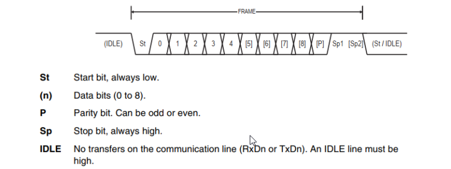

# UART / USART

<aside>
📖 USART 직렬 통신 원리 및 프로토콜을 이해할 수 있다

</aside>

<aside>
📖 개념

## 통신의 분류

### 직렬 통신(시리얼 통신)

: 라인이 하나, 송수신 거리가 멀어도 제한없음

- UART : 비동기 모드로서 사용되는 시리얼 통신
- USART : 동기/비동기 모드로서 사용되는 시리얼 통신(반이중 통신)
    - 데이터 동기화를 위해 클럭 신호가 필요

### 병렬 통신(버스)

: 라인이 여러개, 데이터 동시 송수신 가능, 거리가 멀면 간섭이 생겨 통신 거리가 짧음, 여러 라인으로 비용이 많이 듬

</aside>

<aside>
📖 원리

- Tx : Transmit (송신)
- Rx : Receive (수신)
- XCK : 클럭

동기 모드

비동기 모드

- 데이터 프레임 포맷
    - start bit : 시작 비트(항상 0)
    - P : 패리티 비트 (오류 검출 비트)
    - stop bit : 종료 비트(항상 1)
    - 0~8 : 데이터 전송 비트

- 동기 모드 시 전송 방법
    - UCPOL이 1이면 LOW 엣지에서 변경되고 HIGH 엣지에서 샘플링 된다
    - UCPOL이 0이면 HIGH 엣지에서 변경되고 LOW 엣지에서 샘플링 된
</aside>

<aside>
📖 종류

### Polling 모드

- CPU가 지속적으로 I/O 장치를 쿼리하고 장치의 요구 사항 처리

### Interrupt 방식

- I/O 작업 완료 시 I/O 장치 컨트롤러, IRQ 라인을 통해 프로세서로 인터럽트 신호 전송
- 프로세서, 신호 수신 시 데이터 전송을 처리하기 위해 핸들 프로그램 중단

### DMA 모드

- CPU 중간 개입없이 직접 메모리 액세스를 통해 메모리와 I/O 장치 간 데이터 블록 전송
</aside>

<aside>
📖 특징

- 클락을 필요로 함 ⇒ 데이터와 Timer가 모두 필요
- 데이터를 고정 속도로 전송함
- 다른 모든 요소가 일정하게 유지되면 동기 모드는 비동기 모드보다 높은 DTR(데이터 전송 속도)를 가진다
</aside>

<aside>
📖 장점

- 데이터 동기화로 데이터 송수신 효율이 높음
- 데이터를 일반적으로 블록 형태로 전송하고 115kb보다 빠름
</aside>

<aside>
📖 단점

- 클락 핀이 필요하기에 구조적인 어려움과 비용이 비쌈
</aside>