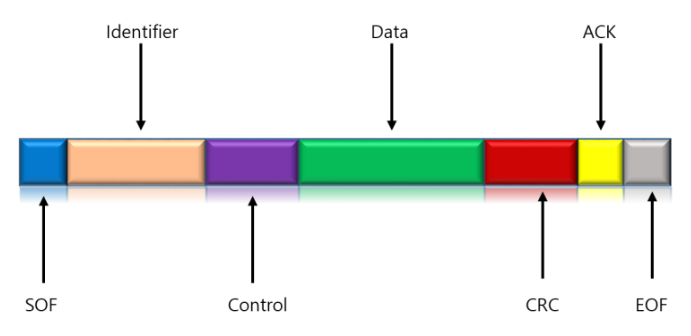

<aside>
📖 **CAN : Controller Area Network**

</aside>

<aside>
📖 **CAN 통신의 특징 및 장점**

CAN 통신 : 여러 개 ECU를 병렬로 연결하여 데이터를 주고받는 통신 방법

CAN 버스를 통해서 통신선 상에 데이터를 띄어놓고 필요한 데이터에 접근(Access)한다

1. 다중 주인(Multi Master) 통신 방식
    
    : CAN 버스는 다중 주인 방식으로 통신하므로 통신 버스를 여러 노드(node)들이 공유하면서 언제든지 버스를 사용할 수 있다.
    
2. 간단한 구조
    
    : CAN_High, CAN_Low 두 개의 신호로 통신하므로 단 2개의 선이 필요로 한다
    
    : 많은 모듈이 추가되더라도 추가되는 선의 양이 적다
    
3. 잡음에 매우 강함
    
    : CAN BUS는 Twist Pair 2선으로 되어있어 전기적 잡음(noise)에 강해 메시지를 보호할 수 있다
    
4. ID 값을 이용한 우선순위
    
    : 자동차 ECU는 CAN 메시지들은 고유한 ID 값을 가지고 있는데 ID 값은 낮을수록 우선순위가 높고, CAN에서는 여과 과정(filtering)을 통해 설정된 ID 값으로 우선순위를 결정한다
    
    : 주소가 아닌 ID 값으로 메시지 내용과 우선순위가 결정되며 이는 시스템 제어 속도와 안정성을 향상할 수 있다
    
5. 고속 및 원거리 통신
    
    : CAN 통신은 최대 1M bps에 달하는 고속 통신 제공
    
    : 최대 1,000m까지 원거리 통신이 가능하다
    
6. PLUG & PLAY 기능
    
    : PLUG & PLAY 기능을 제공 ⇒ controller를 버스에 간편하게 연결하고 끊을 수 있음
    
</aside>

<aside>
📖 **CAN 프레임 구조**

CAN 통신은 프레임이라고 하는 패킷(packet)으로 데이터를 전송한다

프레임 : 하나의 메시지를 이루는 필드 또는 bit들의 집합을 말하며 CAN 프레임은 다음과 같은 분할 구역(section)으로 구성되어있다

1. SOF(Start Of Frame) 비트
    
    : 메시지의 시작을 의미하는 주요한 비트로 버스의 노드(node)를 동기화하기 위해 사용
    
2. Identifier(ID)
    
    : 식별자, 우선순위 부여, ID의 길이에 따라 표준 CAN과 확장 CAN 두 가지 양식(mode)으로 구분
    
3. Control
    
    : 데이터의 길이(DLC)를 의미
    
4. Data
    
    : 전달하고자 하는 내용을 의미
    
5. CRC
    
    : 프레임의 송신 오류 및 오류 검출에 사용됨
    
6. ACK 비트(Bit)
    
    : 오류가 없는 메시지가 전송되었다는 것을 의미하는 비트
    
    : CAN 제어기는 메시지를 정확하게 수신했다면 ACK 비트를 전송
    
7. EOF(End Of Frame) 비트
    
    : 프레임의 끝을 나타내고 종료를 의미
    
</aside>