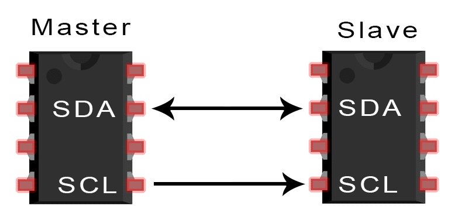
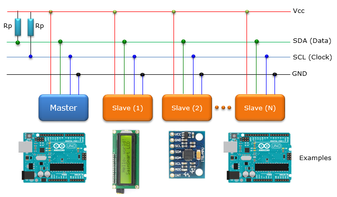
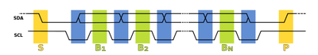

<aside>
📖 **I2C : Inter-Integrated Circut**

</aside>

<aside>
📖 **I2C 구조**

IC 사이 통신 링크를 제공하는 양방향 2와이어 직렬 버스

즉, 두가닥으로 직렬 통신을 하는 통신프로토콜

1. 첫 번째 가닥 ⇒ SDA 선
    
    : 데이터를 주고 받기 위한 선
    
2. 두 번째 가닥 ⇒ SCL 선
    
    : 타이밍을 동기화 하기 위한 클럭 선
    
3. 하나의 마스터와 다른 하나의 슬레이브로 구성

</aside>

<aside>
📖 **I2C 풀업저항**

1. SDA와 SCL은 풀업 저항에 의해 기본 High임
2. SCA 신호가 LOW로 떨어질 때가 시작 신호라고 판단
3. SCL 선으로 클럭 신호가 만들어짐 → 클럭 신호가 LOW일 때 SDA 신호를 비트 신호로 바꿈, 클럭 신호가 HIGH일 때 SDA 신호를 읽음
</aside>